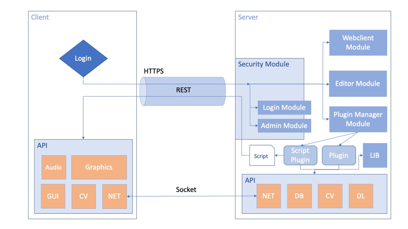
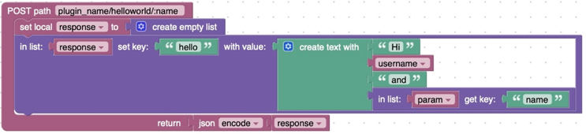
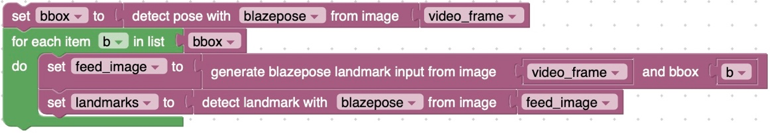
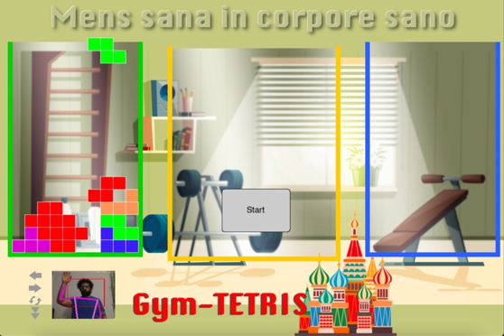
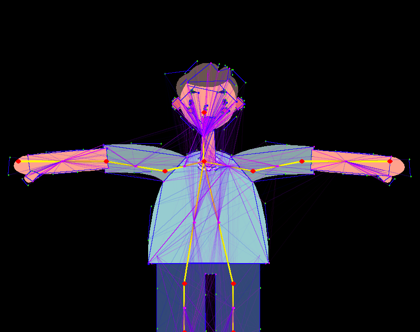

# Proteo

Proteo is an open-source and cross-platform scriptable platform, highly modular and with built-in support for many useful modules for **Serious Games** implementation. Developing a cross-platform, scriptable solution for multimedia applications even with computer vision and **Deep Learning** support is a challenging task, since many different components have to be connected and tuned to reach a robust yet performative system:

- Lua for script
- SDL for graphics and audio
- OpenCV for computer vision
- Enet and ZMQ for networking
- Sqlite and Ejdb for database
- TensorflowLite for machine learning
- Ffmpeg for codecs 

Proteo consists of two main applications, Proteo Server and Proteo Client, both written in C using libraries that can be ported to the main hardware and software platforms. The API is designed to be minimal and easy: one API for client and server.



Proteo is distributed under the MIT License. 

## Proteo Architecture

### Server

Each Proteo server exposes a REST interface depending on the active plugins. Each plugin operates independently and each endpoint is defined by a verb (in the example GET), a path and a function:

```lua

local json=require "json"

proteo.route.get("plugin_name/helloworld/hi/:name",

	function(username,permission,data,param) 
  
		local response={}
		response["hello"]="Hi "..username.." and "..param["name"]

		return json.encode(response)
    
	end
)

```
The path can contain variables (in the example :name). The function arguments are the username, the user permissions, the data passed during the function call, and the pa-rameters passed by the path. Conventionally, the function returns a JSON string, but any string is allowed.

There are three types of script files in Proteo: plugin, script and lib. Every type of script is written in Lua and stored in specific folders within the server root folder. Given the aim of making Proteo easy to program, in addition to being able to edit scripts manually, it is possible to act at a higher level of abstraction through visual programming.

Using [Blockly](https://developers.google.com/blockly), it is possible, for instance, to translate the previous function into a block::



In order to optimize visual programming, the aim is to further abstract the programming level through the use of libraries.  
For example, to estimate the pose from a frame using the [Blazepose](https://google.github.io/mediapipe/solutions/pose.html) algorithm, an appropriate library has been created:



Although Blockly can reproduce each of the constructs of the Lua language, it is specifically intended for users who have no development skills. In the context of serious game development, with Blockly, starting with a serious game model, we give everyone a chance to overcome technical skill barriers, and achieve autonomy. 

### Client

Proteo is designed following the cloud computing paradigm. A Proteo client can be an empty container: the interface, multimedia and computational resources lie on the server. During login the client receives a “task”. This task may depend on the request, but also on user’s permissions or other conditions. In addition, the client also receives the addresses of the secondary servers from the main server, thus transparently distributing the workload in the cloud. 

```lua

local json=require "json"

function hi_callback(res,data)

  proteo.system.console(data.hello)
  
end

function init()

  proteo.network.proteo_get("plugin_name/helloworld/hi/max",hi_callback)

end

```
## Installation


## Server

sudo apt install git cmake lua5.1 liblua5.1-0-dev libssl-dev libcurl4-openssl-dev libsqlite3-dev libmicrohttpd-dev libjson-c-dev libenet-dev

## Client 

### Linux
Test: Ubuntu ... Raspberry ...

### OSX

### iOs

### Windows


## Config

After installation, you need to configure the config.json file on the server and client.

[Detail](https://github.com/massimobernava/proteo/wiki/Config-file)


## API

A few examples. For [details](https://github.com/massimobernava/proteo/wiki/API)

### Example

```lua

--Example Gui

function init()
	form_gui=proteo.gui.newForm("form_gui","SimpleForm",'Helvetica',20,"black","crimson","blanchedalmond",30,proteo.gui.FormType.Normal,"","",MID_X,MID_Y,250,250,"")
	buttonform_gui=proteo.gui.newButton('buttonform_gui',"form button",'Helvetica',15,"black","cornsilk",1,"crimson",false,20 ,50,100,25,"")
	proteo.gui.addItem(form_gui,buttonform_gui)
end

```

```lua

--Example OpenCV

proteo.system.console()

```

## Flat Themed Gui

## Gym Tetris



## Jump'n'Bump Porting
[Wiki](https://en.wikipedia.org/wiki/Jump_%27n_Bump)


## Pose Animator Porting



**How to cite:**
>Bernava, G.; Nucita, A.; Iannizzotto, G.; Caprì, T.; Fabio, R.A. Proteo: A Framework for Serious Games in Tele-rehabilitation. Preprints 2021, 2021050290 
